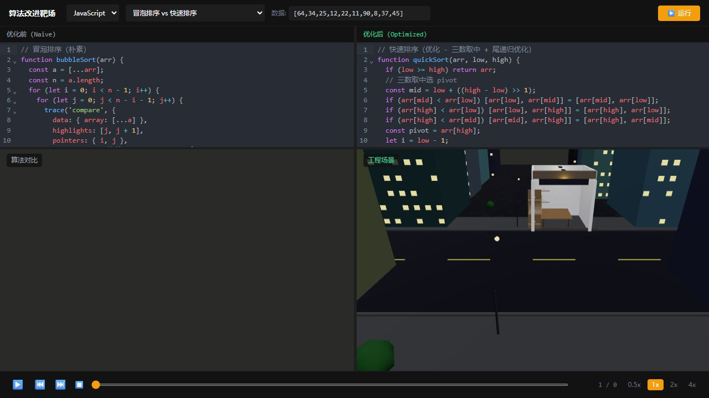
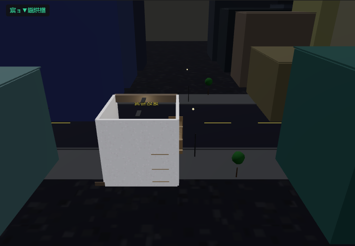
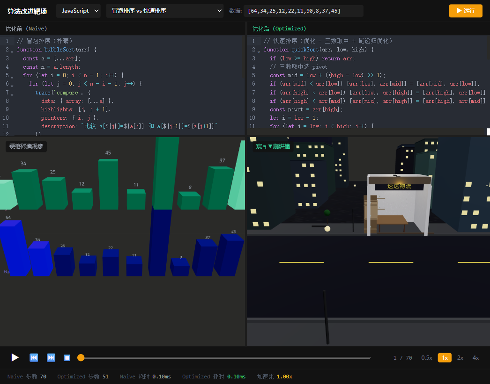
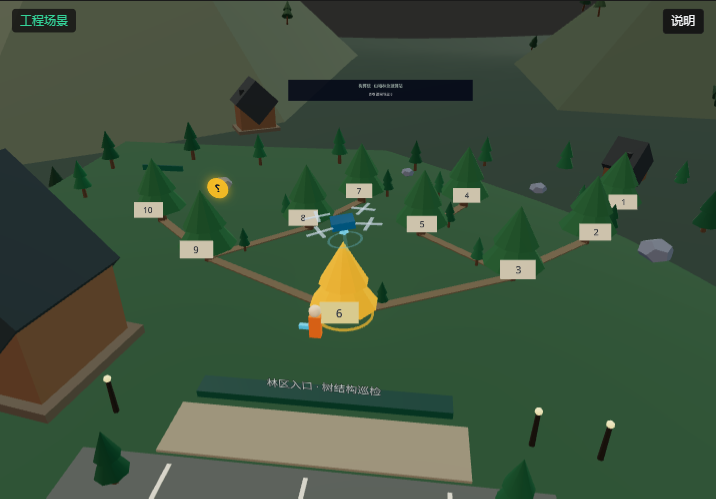
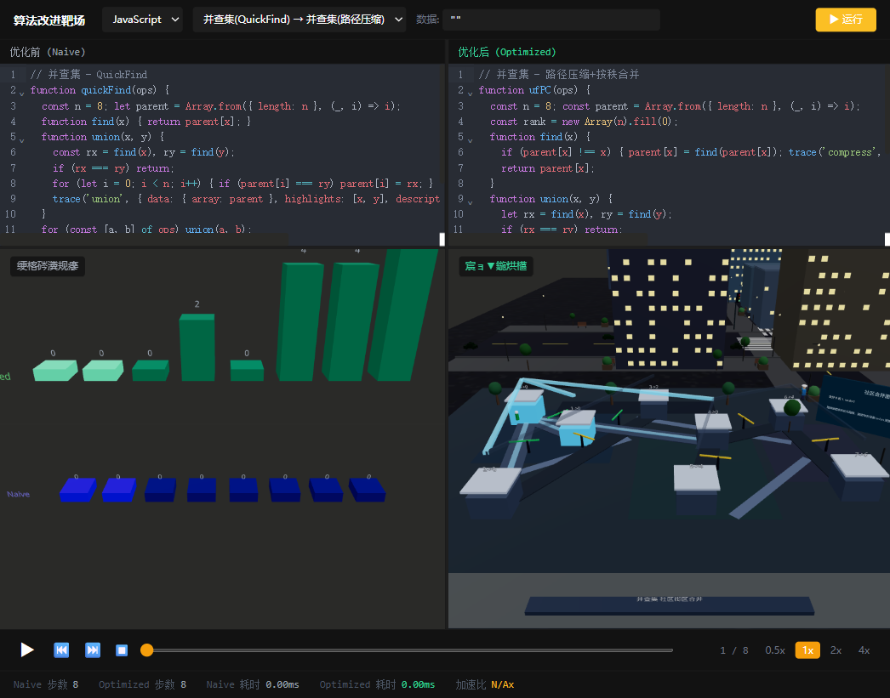

# 算法改进靶场 (DSA Improvement Range)

> 3D 沉浸式数据结构与算法可视化对比平台



## 简介

算法改进靶场是一个交互式 3D 算法可视化平台。它的核心设计理念是 **"朴素 vs 优化" 双栏对比执行**——左侧运行朴素算法实现，右侧运行优化版本，两边每一步都在 3D 场景中实时呈现，支持逐帧播放对比。

目前内置 **40+ 种算法对比模板**，覆盖排序、图、树、动态规划、搜索、字符串六大类别，每种算法都提供 JavaScript 和 Python 双语言版本。



## 核心特性

- **双栏对比** — 朴素 vs 优化算法并排运行，直观展示优化带来的效率提升
- **3D 沉浸场景** — 算法映射到真实世界场景：城市、工厂、森林、图书馆、变电站…
- **逐步播放** — 支持 step-by-step 回放、自动播放（0.5x ~ 4x）、回退
- **多语言执行** — JavaScript 沙箱 + Python (Pyodide/WASM) 双引擎
- **代码编辑器** — CodeMirror 6，支持 JS/Python 语法高亮
- **统计面板** — 显示朴素 vs 优化的步骤数、执行时间、加速比



## 技术栈

| 技术 | 用途 |
|------|------|
| React 18 | UI 框架 |
| Three.js / @react-three/fiber | 3D 渲染引擎 |
| Zustand | 播放状态管理 |
| CodeMirror 6 | 代码编辑器 |
| TypeScript | 类型安全 |
| Tailwind CSS | 暗色主题 UI |
| Vite | 构建工具 |

## 快速开始

```bash
# 安装依赖
npm install

# 启动开发服务器
npm run dev

# 构建生产版本
npm run build

# 预览构建产物
npm run preview
```

## 算法覆盖

### 排序
| 朴素 | 优化 | 优化点 |
|------|------|--------|
| 冒泡排序 O(n²) | 快速排序 (三数取中) O(n log n) | 分治 + 尾递归 |
| 选择排序 O(n²) | 堆排序 O(n log n) | 二叉堆 |
| 插入排序 O(n²) | 希尔排序 | 步长分组 |
| 归并排序 (递归) | 归并排序 (迭代) | 栈溢出规避 |
| 计数排序 | 基数排序 (LSD) | 多关键字 |

### 图算法
| 朴素 | 优化 | 优化点 |
|------|------|--------|
| Dijkstra O(V²) | Dijkstra (优先队列) O(E log V) | 最小堆 |
| Prim O(V²) | Prim (堆优化) O(E log V) | 最小堆 |
| QuickFind | 路径压缩 + 按秩合并 | 摊还 α(n) |

### 字符串
| 朴素 | 优化 |
|------|------|
| 朴素匹配 O(nm) | KMP O(n+m) |
| 最长回文暴力 O(n³) | 中心扩展 O(n²) |
| 异位词排序 | 异位词哈希 |
| 无重复子串暴力 O(n²) | 滑动窗口 O(n) |

### 更多
- **树**: BFS/DFS、树高度、验证 BST、LCA、递归→迭代遍历
- **搜索**: 线性→二分搜索、Two Sum 暴力→哈希、旋转数组二分、峰值二分
- **动态规划**: 0-1 背包 (2D→1D)、LCS、Coin Change、编辑距离、Unique Paths、House Robber

所有算法均有 **JavaScript + Python 双版本**。



## 项目结构

```
src/
├── core/               # 核心类型、执行引擎、播放状态
├── executors/          # 多语言执行器 (JS/Python)
├── templates/          # 算法模板 (40+ 对比实现)
├── scenes/             # 3D 场景层
│   ├── AbstractScenes/ # 抽象可视化 (柱状图、节点图)
│   └── EngineeringScenes/ # 工程场景 (城市、工厂、森林…)
└── components/         # UI 组件 (编辑器、控制栏、统计面板)
```

## 架构

用户选择算法模板 → 代码在 Web Worker 沙箱中执行 → 每一步通过 `trace()` 记录快照 → 3D 场景根据快照逐帧播放 → 支持前进/后退/变速。



## 开发

```bash
# 运行测试
node tests/tree-template-execution.test.mjs
```

## 许可证

MIT
